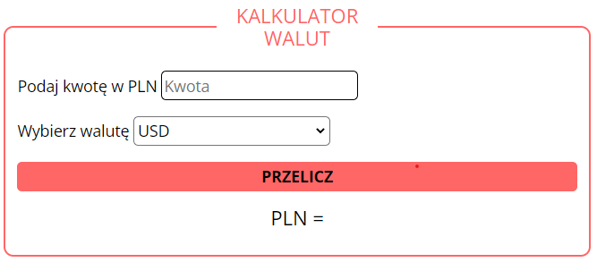
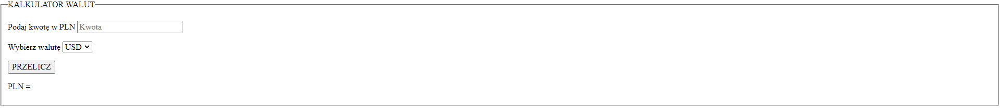

# Simply currency converter

## Demo 

https://mariuszkalinowski.github.io/Currency-converter/

## Discription 

It is simply and easy to use a currency converter. All you need to do is write an amount in input and choose a one of three available currencies. 
You have a choice:
- **USD** 
- **EUR**
- **GBP**

Have fun! 

## About

The currency converter is my first work on GitHub and I am really proud of it. I hope that this will not be my last work and I will soon become a junior frontend developer.

## Short joke about the currency converter 

### expectation
 
### reality

